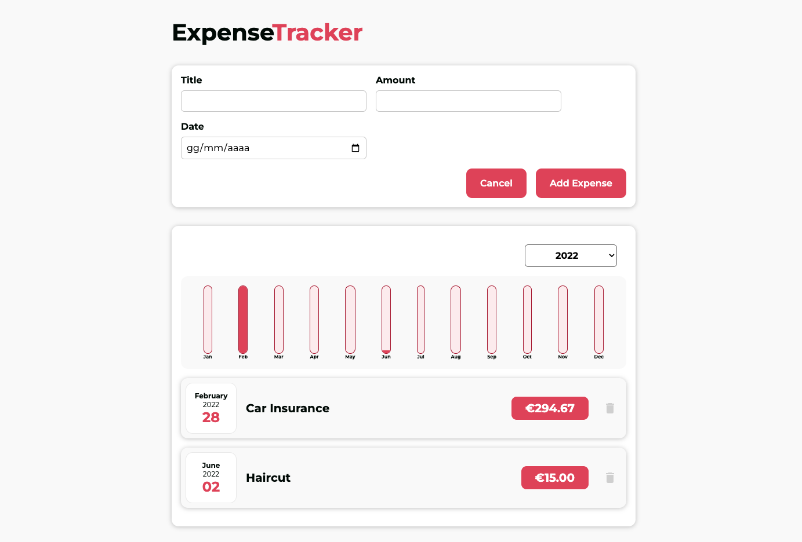

# React Expense Tracker
Very simple Expense Tracker project.
The user can add new expenses typing in the title of the expense, the amount paid and the date in which it occurred.
Below the input form for adding new expenses, the user can browse through the list of all the expenses added which are filtered by year. Furthermore, a column chart shows the trend in expenses over the 12 months of the selected year.

