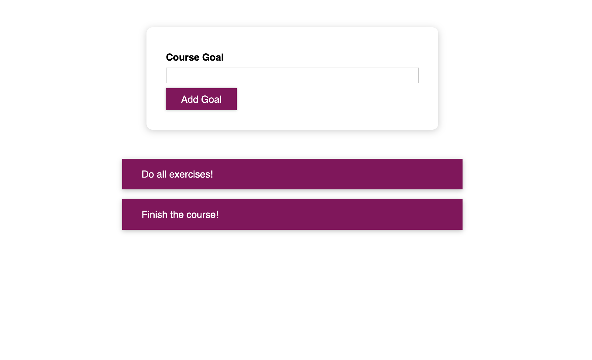

# React ToDo List
Extremely simple ToDo project.
The user can add new goals to the ToDo list and then browse through them as they appear in a list under the input form as well as delete them.
CSS modules with custom styling per each component were used for the styling of the application instead of regular CSS files.

## Usage
Once the repository has been cloned, open the terminal inside the project folder and use the following command to install all the dependencies needed:

`$ npm install`

Subsequently, to start the application, use the command:

`$ npm start`

