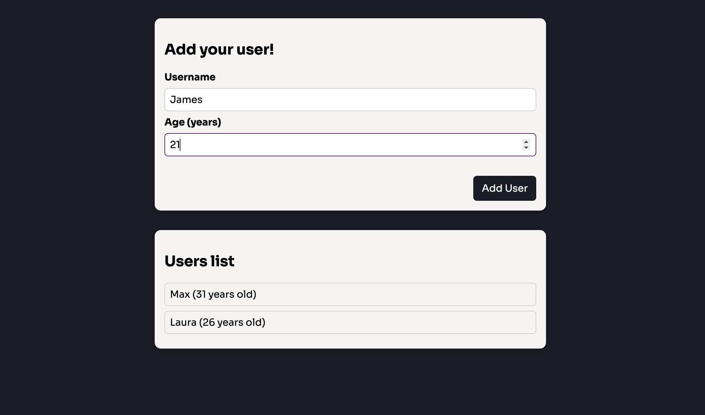

# React Create Users
Extremely simple project for creating users by typing in basic information. Implementation of modal dialogs for displaying error messages.

## Usage
Once the repository has been cloned, open the terminal inside the project folder and use the following command to install all the dependencies needed:

`$ npm install`

Subsequently, to start the application, use the command:

`$ npm start`

