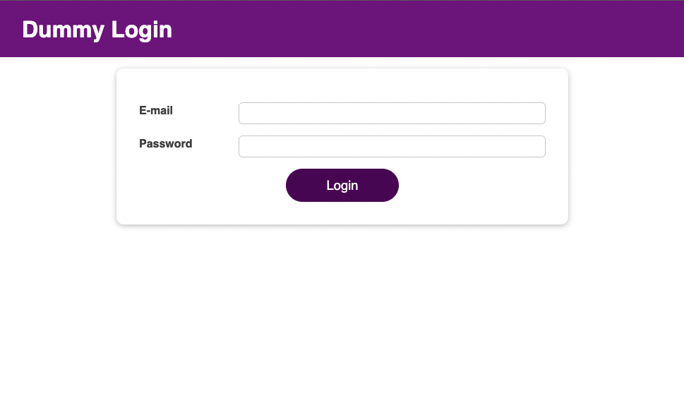
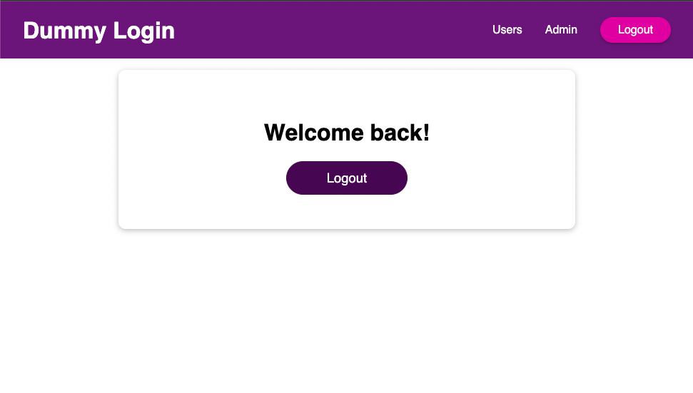

# React Dummy Login
Simple dummy login project for authenticathing and using local storage to save the session.

## Usage
Once the repository has been cloned, open the terminal inside the project folder and use the following command to install all the dependencies needed:

`$ npm install`

Subsequently, to start the application, use the command:

`$ npm start`

